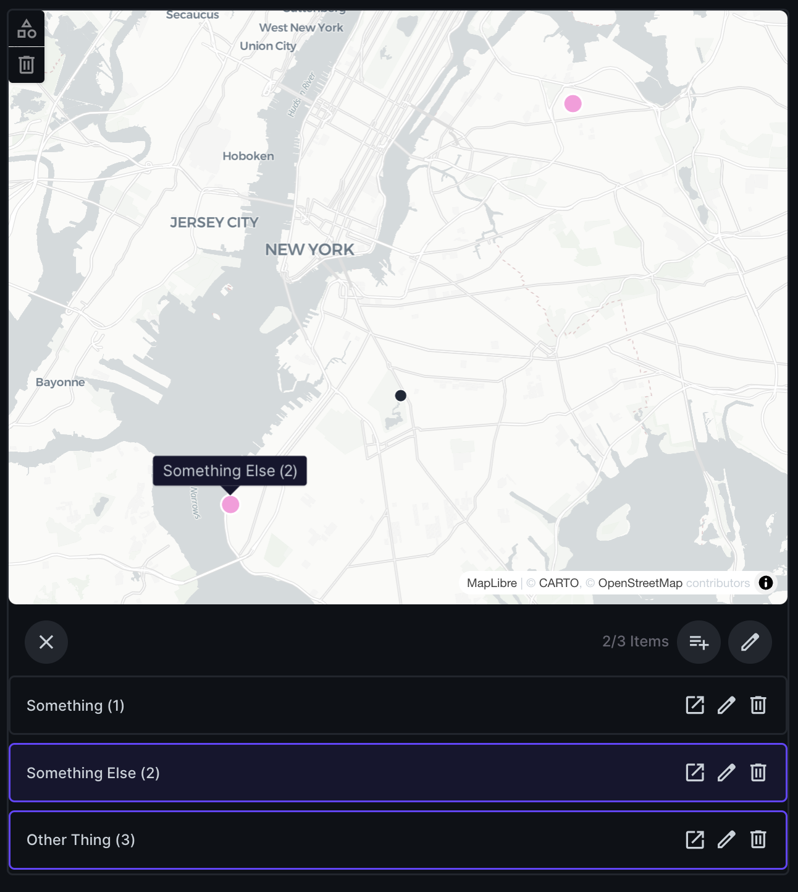

# Directus Extension: O2M Map Interface

A custom interface for [Directus](https://directus.io) that lets you view and manage **one-to-many (O2M) relationships** directly on an interactive map. It is designed for geospatial collections where you want to select, highlight, and filter related items using a MapLibre-based map interface.



## Features

- 🔍 View related items as points or polygons on a map.
- 🖱️ Select and edit individual or batch features.
- 🗺️ Support for multiple geometry types (`Point`, `Polygon`, etc.).

## Installation

```bash
git clone https://github.com/beasteers/directus-extension-o2m-map-interface.git
docker compose up -d --build
```

## Usage

1. In Directus, add a **one-to-many** (O2M) relational field to your collection.
2. In the field options, choose **O2M Map Interface** as the display interface.
3. Configure:
   - **Geometry Field**: which field to use for spatial data (e.g. `geom`).
   - **Display Fields**: metadata to show in tooltips or side panels.
   - **Selection Behavior**: whether polygons should auto-select contained points.

Once configured, you can interactively select/deselect items on the map. When polygons are toggled, the points inside them are also toggled automatically.

## Development

- Run in watch mode:

  ```bash
  npm run dev
  ```

- Lint and format:

  ```bash
  npm run lint
  npm run format
  ```

- Build production version:

  ```bash
  npm run build
  ```

## Roadmap

- [ ] Add rectangle and freehand lasso selection tools.
- [ ] Support clustering for large point datasets.
- [ ] Custom styles per collection.

## License

MIT © 2025 FloodNet